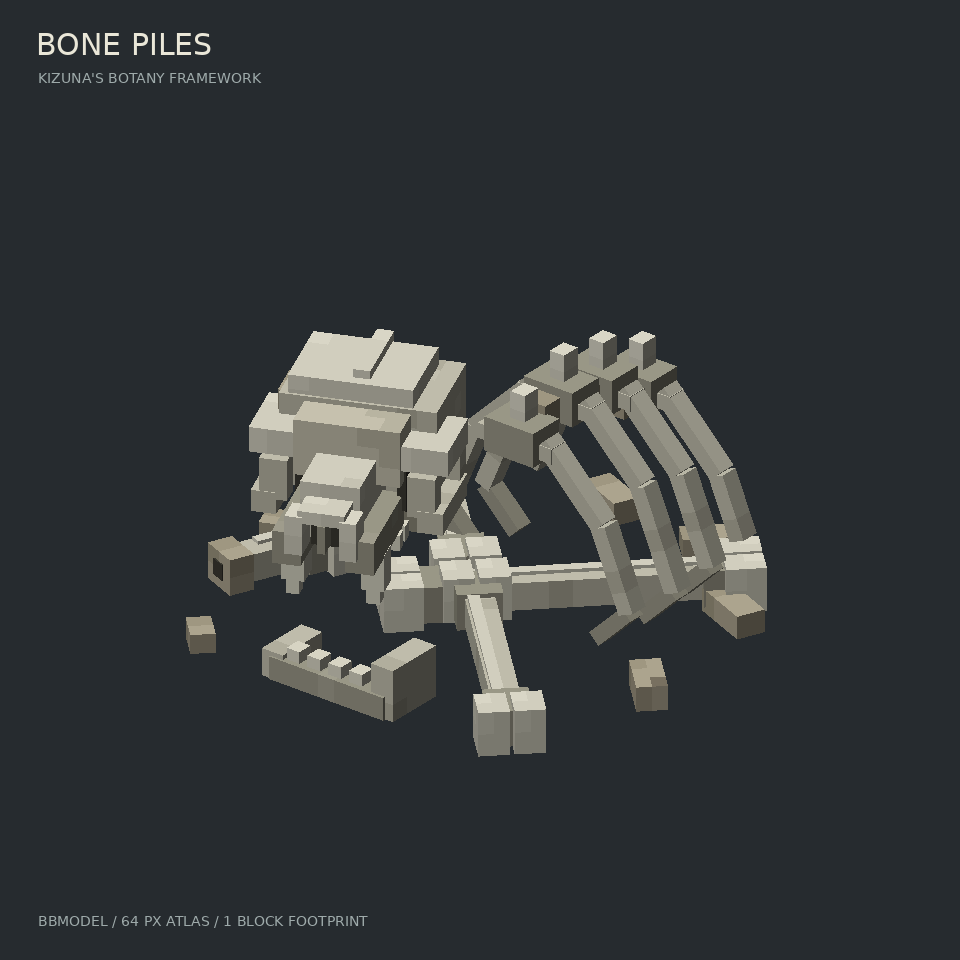

# BonePiles 骨堆作者稿

一格范围内的低矮风化兽骨堆：偏斜的兽颅、残缺胸腔、交错长骨与散落颌骨。
眼眶由骨框和内退暗壁组成，肋骨是有厚度的弧段；没有垫底石台，也没有植物或特效。

直接用 Blockbench 打开 **[BonePiles.bbmodel](BonePiles.bbmodel)**。64×64 像素贴图已内嵌，
不需要寻找外部贴图路径。四组部件分别为兽颅、肋骨/脊椎、长骨、颌骨/碎片。



[正面、右侧和俯视图](views.png)直接从同一份 `.bbmodel` 渲染。它们是离线模型预览，
不代表游戏内光照、碰撞或掉落的验收。

## 输入与输出

| 文件 | 职责 |
| --- | --- |
| `model.py` | 部件尺寸、位置、材质、分组；模型单位为 1/16 格 |
| `generate.py` | 色板贴图、UV、格式导出与边界校验 |
| `preview.py` | 读取落盘的作者稿，输出主视图与共用取景的三视图 |
| `BonePiles.bbmodel` | 可在 Blockbench 中继续编辑的源模型 |
| `bone_pile.png` | 独立贴图，与内嵌贴图逐字节一致 |
| `export/assets/kizuna_botany/` | 原生 Java 方块模型、物品模型和贴图 |

几何约束：110 个非退化立方体、4 个编辑组；使用 Java 1.20.1 支持的单轴
`0/±22.5/±45°` 旋转，无组旋转；旋转后的顶点均在一格 `0..16` 内。
高度 6.8/16 格，底部 y=0，兽颅朝 +z 后绕 y 偏转 22.5°。

## 重现

在仓库根目录执行：

```bash
python3 "authoring/bone_piles/generate.py"
python3 "authoring/bone_piles/preview.py"
```

生成器只依赖 Python 3 与 Pillow；预览额外使用作者环境已安装的
`bbmodel_maker.render` 和 NumPy，未将这些作者工具引入运行时 Jar。
生成结果可重复，重新执行生成器会覆盖本目录内的生成文件；如直接在 Blockbench
精修过作者稿，应先另存一份，或将修改同步回 `model.py`。

## 接入范围

`export/` 提供资源，资源地址为 `kizuna_botany:block/bone_pile`，不再依赖 SML/OBJ。
本次先交付可预览模型，导出目录尚未放入运行时资源，不登记方块，也不改变碰撞和掉落。
原来的 `migration/optional-bone-pile/` 归档和 Bong 原工作区保持不变。
新模型适用仓库根目录的非商业使用许可。
